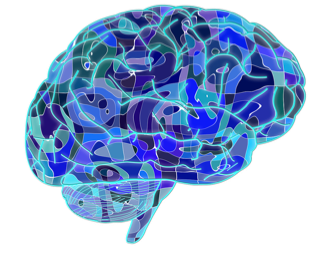

<br />
<p align="center">
  <a href="https://github.com/RQGenerator/Brain-Squizz">
    
  </a>

  <h3 align="center">Brain Squizz</h3>

  <p align="center">
    Challenge your knowledge and have fun at the same time!
    <br />
    <a href="https://github.com/RQGenerator/Brain-Squizz"><strong>Explore the docs »</strong></a>
    <br />
    <br />
    <a href="https://brain-squizz.herokuapp.com">View Demo</a>
    ·
    <a href="https://github.com/RQGenerator/Brain-Squizz/issues">Report Bug</a>
    ·
    <a href="https://github.com/RQGenerator/Brain-Squizz/issues">Request Feature</a>
  </p>
</p>

<!-- TABLE OF CONTENTS -->
<details open="open">
  <summary><h2 style="display: inline-block">Table of Contents</h2></summary>
  <ol>
    <li>
      <a href="#about-the-project">About The Project</a>
      <ul>
        <li><a href="#built-with">Built With</a></li>
      </ul>
    </li>
    <li>
      <a href="#getting-started">Getting Started</a>
      <ul>
        <li><a href="#prerequisites">Prerequisites</a></li>
        <li><a href="#installation">Installation</a></li>
      </ul>
    </li>
    <li><a href="#usage">Usage</a></li>
    <li><a href="#roadmap">Roadmap</a></li>
    <li><a href="#contributing">Contributing</a></li>
    <li><a href="#license">License</a></li>
    <li><a href="#contact">Contact</a></li>
    <li><a href="#acknowledgements">Acknowledgements</a></li>
  </ol>
</details>

<!-- ABOUT THE PROJECT -->

## About The Project

[![Product Name Screen Shot][product-screenshot]](https://example.com)

### Built With

- [Create React App](https://create-react-app.dev)
- [TailwindCSS](https://tailwindcss.com)
- [Ant Design](https://ant.design)
- [Styled Components](https://styled-components.com)
- [React Countdown Circle Timer](https://www.npmjs.com/package/react-countdown-circle-timer)
- [he](https://github.com/mathiasbynens/he)

<!-- GETTING STARTED -->

## Getting Started

To get a local copy up and running follow these simple steps.

### Prerequisites

Make sure you have the latest npm installed by running this command

- npm
  ```sh
  npm install npm@latest -g
  ```

### Installation

1. Clone the repo
   ```sh
   git clone https://github.com/RQGenerator/Brain-Squizz.git
   ```
2. Install npm packages
   ```sh
   npm install
   ```

<!-- USAGE EXAMPLES -->

## Usage

1. Start the app
   ```sh
   npm start
   ```
2. Enjoy the game and challenge your friends

Refer to the documentation for further information on the gameplay and rules of the game 🎰

_[Documentation](https://rqgenerator.github.io/Brain-Squizz/)_

<!-- ROADMAP -->

## Roadmap

See the [open issues](https://github.com/RQGenerator/Brain-Squizz/issues) for a list of proposed features (and known issues).

\_Save generated quiz
\_Challenge friends
\_Soundtrack

<!-- CONTRIBUTING -->

## Contributing

Contributions are what make the open source community such an amazing place to be learn, inspire, and create. Any contributions you make are **greatly appreciated**.

1. Fork the Project
2. Create your Feature Branch (`git checkout -b feature/AmazingFeature`)
3. Commit your Changes (`git commit -m 'Add some AmazingFeature'`)
4. Push to the Branch (`git push origin feature/AmazingFeature`)
5. Open a Pull Request

Happy coding 🧑‍💻

<!-- CONTACT -->

## Contact

Guilherme Rodrigues - [](https://www.linkedin.com/in/guilherme-rodrigues-029344162/) - [](https://github.com/Guilhaxr)

Victor Isidoro - [](https://twitter.com/vtr84) - [](https://www.linkedin.com/in/victorisidoro/) - [](https://www.github.com/vtr84/)

Project Link: [https://github.com/RQGenerator/Brain-Squizz](https://github.com/RQGenerator/Brain-Squizz)

<!-- ACKNOWLEDGEMENTS -->

## Technologies Used


